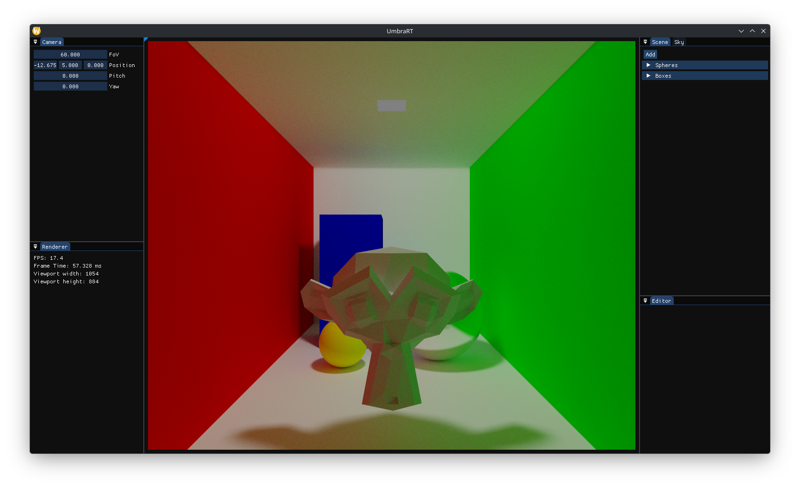
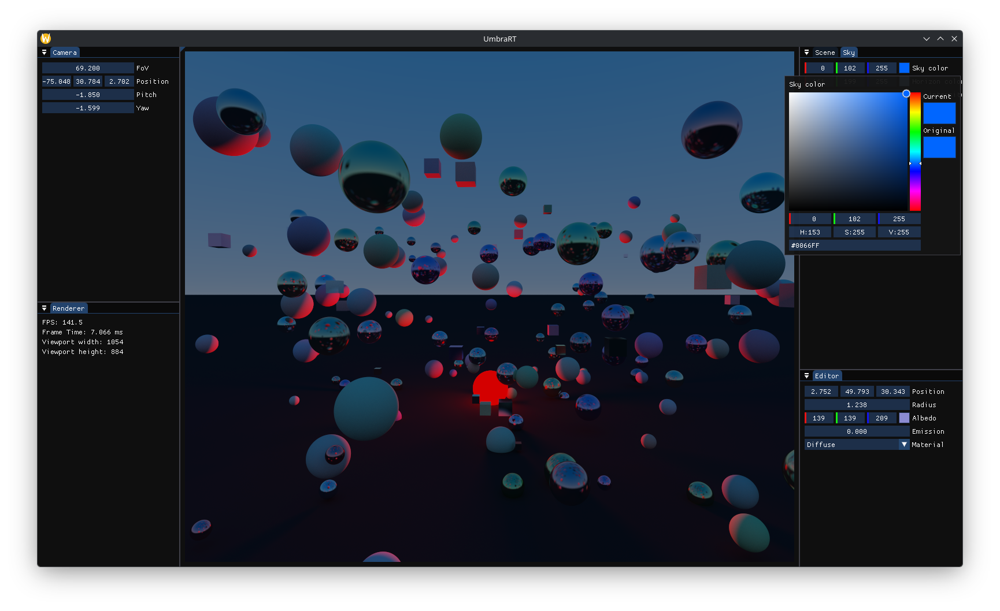
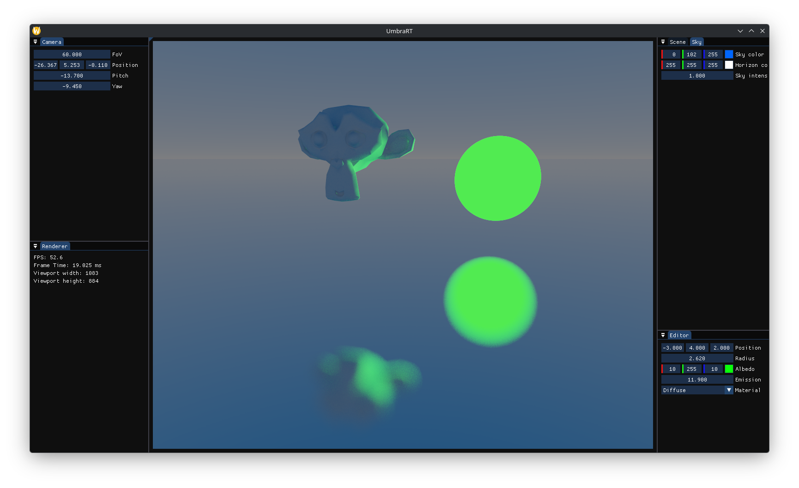

# UmbraRT
UmbraRT is a C++/OpenGL renderer that traces rays directly on the GPU to produce physically-inspired lighting, with progressive sample accumulation across frames.





## Features

- Realtime ray tracing rendered via custom shaders
- Built-in geometric primitives: spheres, planes, and boxes
- 3D model loading from `.obj` files via `tinyobjloader`, with triangle meshes.
- Material system to control surface appearance
- Accumulation buffer to progressively refine the image across frames
- Controllable camera and custom input system
- Realtime debug UI built with `Dear ImGui` to inspect and tweak the scene
- Scene system to organize rendered objects

##  Technologies used

| Component                                                       | Purpose |
|-----------------------------------------------------------------|---|
| C++20                                                           | Main language |
| CMake ≥ 4.2                                                     | Build system |
| OpenGL 3.3                                                      | Graphics API |
| [GLFW](https://www.glfw.org/)                                   | Window and OpenGL context creation |
| [GLAD](https://glad.dav1d.de/)                                  | OpenGL function loading |
| [GLM](https://github.com/g-truc/glm)                            | Vector/matrix math |
| [Dear ImGui](https://github.com/ocornut/imgui)                  | Debug UI |
| [tinyobjloader](https://github.com/tinyobjloader/tinyobjloader) | `.obj` model importing |


## Building

### Prerequisites

- A compiler with **C++20** support
- **CMake 4.2** or newer
- Graphics drivers with **OpenGL** support
- All third-party dependencies are already included as sources/submodules under `external/`
### Steps

```bash
# Clone the repository (including submodules, if applicable)
git clone --recursive https://github.com/joaovvbonatti/UmbraRT.git
cd UmbraRT
 
# Configure and generate build files
cmake -B build -S .
 
# Build
cmake --build build
 
# Run
./build/UmbraRT
```

> During the build, CMake automatically copies the `shaders/` and `assets/` folders next to the executable, so there's no need to move them manually.

## Controls

- WASD and mouse: move camera
- Press TAB to alternate between camera controls and GUI cursor

##  Roadmap

- Update project to OpenGL 4.3
- Rewrite the implementation using compute shaders
- BVH
- More primitives (cylinders, toroids, etc)
- Better materials system